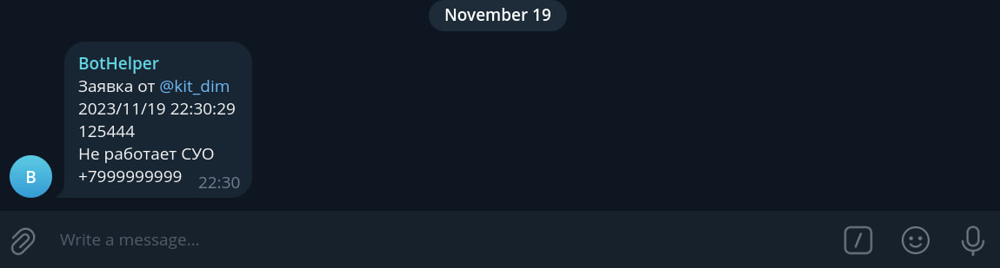
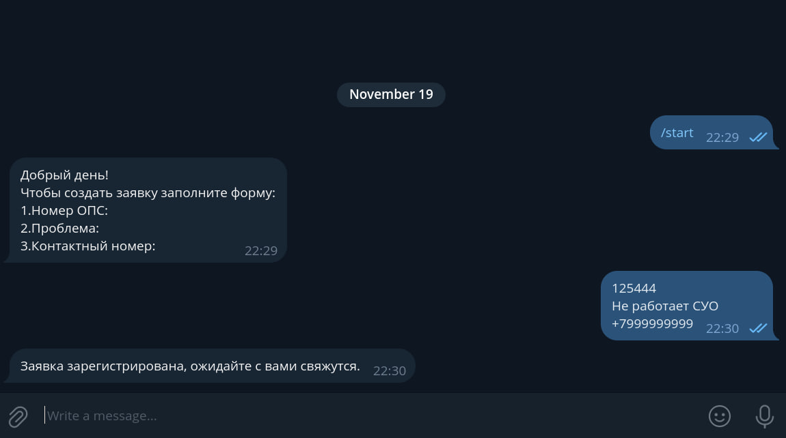

### Tests and linter status:
[](https://github.com/kitdim/opsBot/actions/workflows/java-ci.yml)
[](https://codeclimate.com/github/kitdim/opsBot/maintainability)
[](https://codeclimate.com/github/kitdim/opsBot/test_coverage)
### botOps
An application for quickly creating applications in noumenon systems. Based on telegram bot.

### Requirements
1) JDK 20 or above
2) Make or use gradle tasks
3) Gradle 8.2 or above

### Usage
1) Download library from GitHub
2) Run in CLI

### Commands
1) make build or ./gradlew clean build, for build
2) make install or ./gradlew clean install, for clean & install
3) make run or ./gradlew run, for run

### Settings
The settings for the telegram bot are located in the config folder.
In the BotConfig.java file, the bot name and token are specified as constants. They can be obtained through BotFather:
```java
public static final String BOT_NAME = "Name";
public static final String TOKEN = "token";
```

In the ItSupportConfig file, the constant contains the id of the telegram channel where notifications from users will be sent:
```java
public static final String ID_GROUP = "id";
```

### Example
1. The user sends an appeal.
   
2. The appeal was received in the pre-created chat room.
   
